# Description of the individual components

Read here to find out how the individual components work and how to use them.


## accordion.tsx 
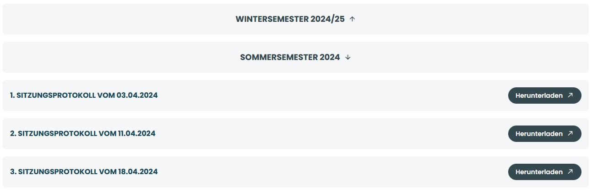

How to use (basic example):

```html
<Accordion title = "Frequently Asked Questions">
  <p>
    This is the content that will be shown when the accordion is expanded.  
    You can include text, lists, images, or any other valid React elements here.
  </p>
</Accordion>
```
How to use (with mapped components):
```html
<Accordion title = {folderDisplayName}>
  {Inhalt.map((file)  = > (
    <ProtokollBox
      key = {file}
      buttontext = "Herunterladen"
      buttonlink = {`/assets/downloads/sitzungsprotokolle/${Ordnername}/${file}`}
    >
      {file.replace(/\.pdf$/i, "")}
    </ProtokollBox>
  ))}
</Accordion>
```
The `accordion` component displays a clickable header with a title and arrow icon.
Clicking the header toggles its open state, rotating the arrow and showing or hiding the content passed as children.


Refer to `sitzungsprotokolle-liste` for the complete component structure.


## box-big.tsx

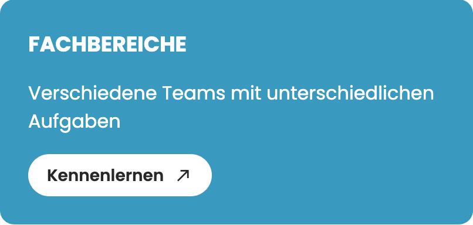

**How to use:**

```html
<BoxBig
    title = {"Fachbereiche"}
    subtitle = {"Verschiedene Teams mit unterschiedlichen Aufgaben"}
    bgcolor = {"primary_blue_bg"}
    buttontext = {"Kennenlernen"}
    buttonlink = {"#"}
></BoxBig>
```

- `bgcolor` is either "primary_blue_bg" or "petrol_pale_bg"
- `newTab` (optional, default: `false`) - if set to `true`, the link will open in a new browser tab

## box-full-width-blue.tsx


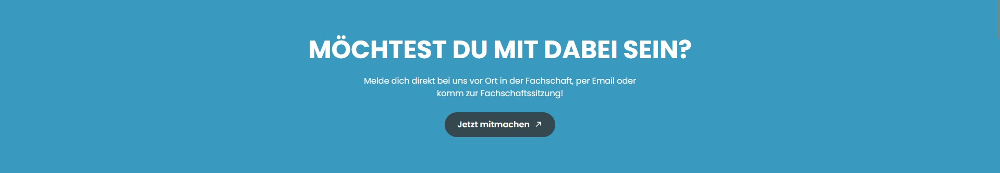

**How to use:**

```html
<BoxFullWidthBlue
    title = "Möchtest du mit dabei sein?"
    subtitle = "Melde dich direkt bei uns vor Ort in der Fachschaft, per Email oder komm zur Fachschaftssitzung!"
    buttontext = "Jetzt mitmachen"
    buttonlink = "#"
    belowText = "optional smaller Text";
/>
```
- `belowText` is optional ( displays a smaller text directly below the button)

Do not place this component inside a ```<ResponsiveWrapper>```, as this will prevent the ```BoxFullWidthBlue``` from taking the full width of the website.


## box-text-button.tsx

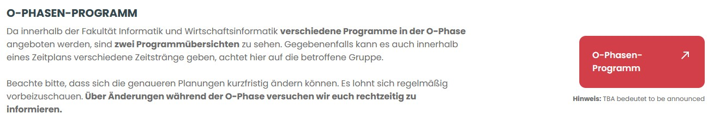

**How to use:**

```html
<TextAndButton
    heading = "O-Phasen-Programm"
    text = "add a very long text"
    boxText = "O-Phasen-Programm"
    boxLink = "#"
    newTab = {true}
    note = {
            <>
            <b>Hinweis:</b> TBA bedeutet to be announced
            </>
          } 
/>
```

The red button itself is technically an imported component called `box`.

- `heading` (optional) - Displays a headline (`h4`) above the content
- `newTab` (optional, default: `false`) - if set to `true`, the link will open in a new browser tab
- `note`  (optional) - shows a small text below the button


## box-text-img.tsx 

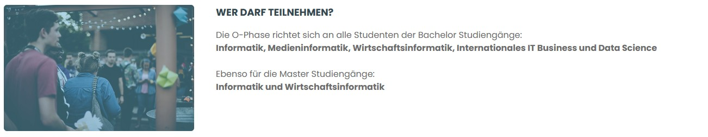

**How to use:**

```html
<BoxTextImg
  imageSrc = "#"
  imageAlt = "alternativ Text for the Image"
  imageAlt = "O-Phase Team"
  overlay = {true}
>
  <h4>Wer darf teilnehmen?</h4>
    <p>
      Die O-Phase richtet sich an alle Studenten der Bachelor Studiengänge:<br />
      <b>Informatik, Medieninformatik, Wirtschaftsinformatik, Internationales IT Business und Data Science</b><br /> <br />
      Ebenso für die Master Studiengänge:<br />
      <b>Informatik und Wirtschaftsinformatik</b>
    </p>
</BoxTextImg>
```

You can place any text or additional JSX content between the opening `<BoxTextImg>` and closing `</BoxTextImg>` tags. This content will be rendered alongside or below the image, depending on the screen size.

- `imageAlt` (optional) - alternative text for the image, used for accessibility and displayed if the image cannot be loaded
- `overlay` (optional) - adds a semi-transparent blue filter over the image for visual emphasis

## breadcrumb.tsx

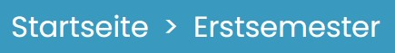

**How to use:**

```html
<Breadcrumb></Breadcrumb>
<-- or -->
<Breadcrumb siteName = "example"></Breadcrumb>
```

Usually the site name is automatically determined. If this doesn't work properly, you can specify a site name manually, as it's done in the component `header-news` to show the name of the article instead of just 'Aktuelles'.<br>
This component is only used within the `header` and `header-news` components.

## button.tsx


**How to use:**

```html
<Button
    type = {"small-blue1"}
    text = {"für Unternehmen"}
    url = {"/Sponsoring-und-Kooperation"}
    newTab = {false}>
</Button>
```

## button-but-bigger.tsx 

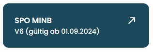

How to use:
```html
<ButtonButBigger
  text = "SPO MIIB"
  subtext = "V6 (gültig ab 01.09.2024)"
  link = "#"
  newTab = {true}
  bgcolor = "petrol"
/>
```
- `subtext` (optional) - smaller text displayed below the main label
- `newTab` (optional, default: `false`) - if set to `true`, the link will open in a new browser tab
- `bgcolor` accepts either "petrol" or "red", determining the background color and style


## carousel.tsx

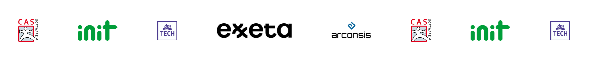

**How to use:**

```html
<Carousel 
  images={carouselImages} 
  speed={15}
/>
```

- `images` - array of `CarouselImage` objects with `url` and `size` properties
- `speed` (optional, default: `15`) - seconds for one complete animation loop

The carousel automatically duplicates the image set 4 times to create a smooth infinite scroll effect. It calculates the total width dynamically based on image sizes and applies CSS animations.

## contact-box.tsx

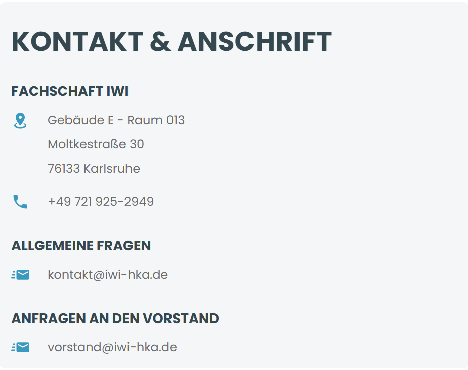

**How to use:**

```html
<ContactBox
  title="Kontakt"
  direction="horizontal"
  contactLists={[
    {
      title: "Allgemeine Anfragen",
      contactItems: [
        {
          imageSrc: "/icons/email.svg",
          items: ["info@example.com"],
          isLink: true
        },
        {
          imageSrc: mdiPhone,
          items: ["+49 123 456789"]
        }
      ]
    }
  ]}
/>
```

- `title` (optional) - heading displayed at the top of the box
- `direction` - either "horizontal" or "vertical" layout
- `contactLists` - array of contact list objects containing:
  - `title` - section heading
  - `contactItems` - array of contact items with:
    - `imageSrc` - path to image file (.png/.svg) or MDI icon path
    - `items` - array of contact information strings
    - `isLink` (optional, default: `false`) - if true, items become clickable links

## cooperationBox.tsx

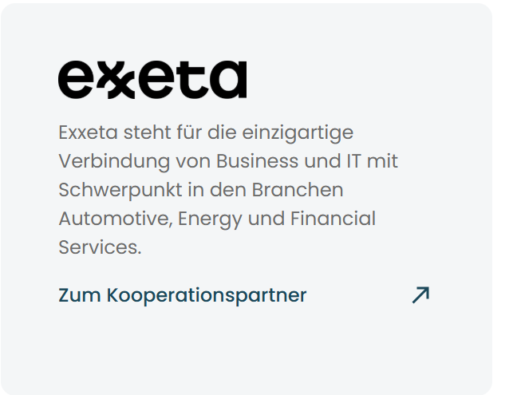

**How to use:**

```html
<CooperationBox
  logo="/logos/company-logo.png"
  description="Kurze Beschreibung der Zusammenarbeit mit dem Partner."
  link="https://partner-website.com"
/>
```

- `logo` - path to the partner's logo image
- `description` - text describing the cooperation
- `link` - URL to the partner's website (opens in new tab)

The component displays a clean card with the partner logo, description text, and a "Zum Kooperationspartner" link with an animated arrow icon.

## event-preview-element.tsx

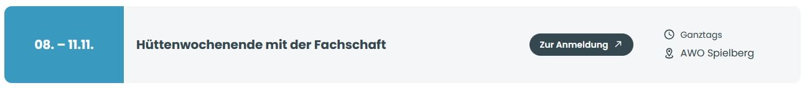

How to use:
```html
<EventElement
  key = {`${title}-${date}`}
  date = {date}
  time = {time}
  title = {title}
  location = {location}
  locationLink = {locationLink}
  buttonLink = {buttonLink}
/>
```

- `locationLink` (optional) - the location becomes a clickable link
- `buttonLink` (optional) - a “Zur Anmeldung” button is shown (both desktop & mobile)

The `EventElement` component is purely for presentation - it receives event details as props and renders them in a responsive layout for both desktop and mobile.
The actual event data is provided by the API route.

TODO: Implement automatic loading of events from the Nextcloud calendar.

## footer-link.tsx


**How to use:**

```html
<FooterLink newtab = "false" href = "/Sponsoring-und-Kooperation" name = "Sponsoring & Kooperation" />
```

## footer.tsx

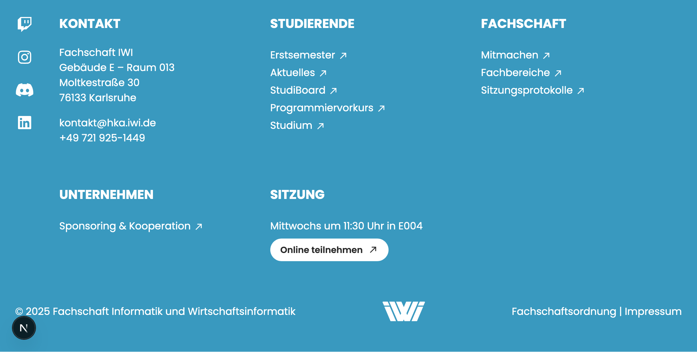

**How to use:**

```html
<footer />
```

This component is only used in \_app.tsx, so it is automatically displayed on every page.

## fs-mitglieder.tsx

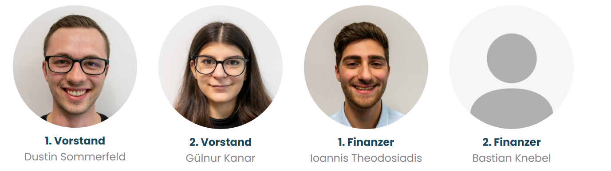

**How to use:**

```html
<FsMitglieder
  mitglieder={[
    {
      img: "/images/member1.jpg",
      position: "Vorstand",
      name: "Max Mustermann"
    },
    {
      img: "/images/member2.jpg", 
      position: "Kassenwart",
      name: "Anna Schmidt"
    },
    null // Empty slot in grid
  ]}
/>
```

- `mitglieder` - array of member objects or null values for empty slots
  - `img` - path to member's profile image
  - `position` - member's role/position in the organization
  - `name` - member's full name

The component displays members in a responsive grid layout (3-6 columns depending on screen size). Null values create empty spaces in the grid. Profile images are automatically displayed as circles.

## header-news.tsx

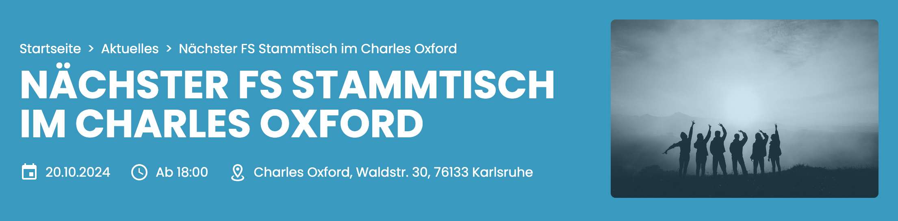

**How to use:**

```html
<HeaderNews
  title = "{newsItem.title}"
  image = "{newsItem.image}"
  date = "{newsItem.eventinfos.date}"
  time = "{newsItem.eventinfos.time}"
  location = "{newsItem.eventinfos.location}"
  locationlink = "{newsItem.eventinfos.locationlink}"
/>
```

This header is shown in every blog post. `date`and `time` are optional, as not every blog post refers to an event. The content is automatically filled by `news_loader.js`. More on that [here](./apis.md#loader_news).


## header.tsx

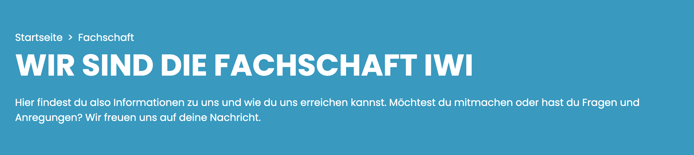

**How to use:**

```html
<header
  title = "Wir sind die Fachschaft IWI"
  subtitle = "Hier findest du also Informationen zu uns und wie du uns erreichen kannst. Möchtest du mitmachen oder hast du Fragen und Anregungen? Wir freuen uns auf deine Nachricht."
></header>
```

You can add `showBreadcrumbs = {false}` if you don't want to show the breadcrumb navigation. This is the case in the 404 and 500 error pages.

This component must be used on every page (excluding `Startseite`, where a Slider is placed at the top and every blog post, `header-news` must be used there)

## infobox.tsx
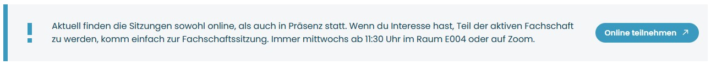 

How to use:

```html
<InfoBox
  icon = {"exclamation"}
  buttonlink = "#"
  buttontext = "Online teilnehmen"
  buttonNewTab = {true}
>
  Aktuell finden die Sitzungen sowohl online, als auch in Präsenz statt. Wenn du Interesse hast, Teil der
  aktiven Fachschaft zu werden, komm einfach zur Fachschaftssitzung. Immer mittwochs ab 11:30 Uhr im Raum E004
  oder auf Zoom.
</InfoBox>
```
- `icon`: accepts either "exclamation" or "heart", determining shown icon
- `buttontext` (optional) - the label shown on the button. If this is missing, no button will be rendered at all
- `buttonlink` (optional) - the URL the button should point to. This also needs to be set for the button to appear.
- `buttonNewTab` (optional, default: `false`) - if set to `true`, the link will open in a new browser tab

You can place any text or additional JSX content between the opening `<InfoBox>` and closing `</InfoBox>` tags. This content will be rendered next to the icon.
 
## infotile.tsx
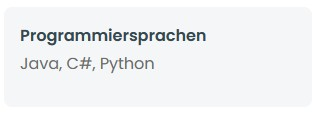

How to use:
```html
<InfoTile 
  title="Programmiersprachen" 
  text="Java, C#, Python" 
/>
```

## InstagramFeed.tsx

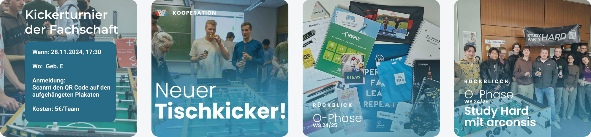

**How to use:**

```html
<InstagramFeed />
```

This component is currently only used in `Startseite`. It fetches the last four Instagram posts from https://www.instagram.com/iwi_fachschaft/ and returns the corresponding images.
TODO: Erklären wie die API funktioniert!

## markdown-section.tsx

**How to use:**

```html
<MarkdownSection fileUrl = {"/impressum.md"}></MarkdownSection>
```

This is not a graphic element. It simply renders the content of a specified .md-file as HTML. Currently only used in 'Impressum'.

## menu.tsx

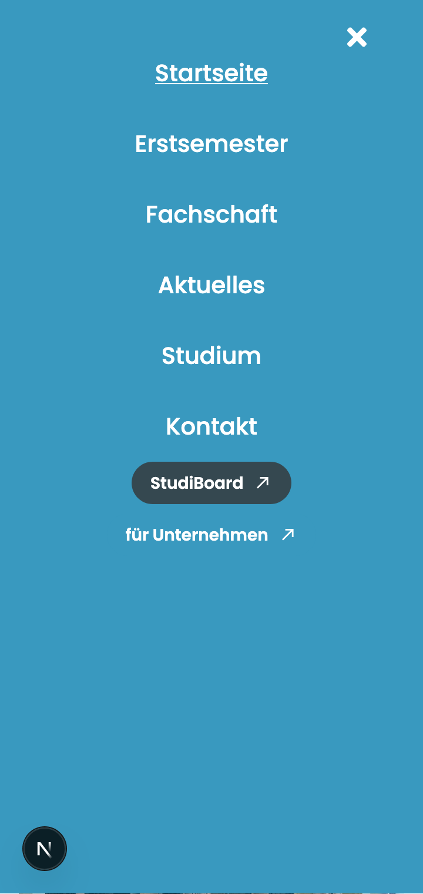


**How to use:**

```html
<menu />
```

The menu is displayed differently on desktop and mobile. The items to display in this component with their corresponding links are defined in the array 'mainMenuItems'.

## study-card.tsx

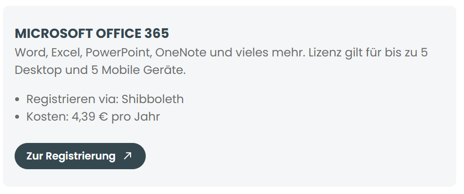

**How to use:**

```html
<StudyCard
  title="Microsoft Office 365"
  subtitle="Word, Excel, PowerPoint, OneNote und vieles mehr."
  listElements={[
    "Registrieren via: Shibboleth",
    "Kosten: 4,39 € pro Jahr"
  ]}
  buttons={[
    {
      text: "Zur Registrierung",
      url: "https://bildung365.de",
      buttonNewTab: true
    }
  ]}
/>
```

- `title` - main heading of the card
- `subtitle` (optional) - descriptive text below the title  
- `listElements` - array of information items displayed as bullet points
- `buttons` - array of button objects with:
  - `text` - button label
  - `url` - button link URL
  - `buttonNewTab` (optional, default: `false`) - opens link in new tab

The component displays content in a card layout with automatic height adjustment. Used primarily on the Studium page to show various student services and resources.

## news-preview-element.tsx


**How to use:**

```html
<NewsPreviewElement 
    key = {index} 
    title = {item.title} 
    subtitle = {item.excerpt} 
    image = {item.image}
    link = {`/Aktuelles/article?item = ${item.uuid}`} 
/>
```

Used in 'Aktuelles' and in 'aktuelles/search'. Every field is filled in automatically from the information provided by the server. Learn [how to create a blog post](./create-blogpost.md) and [how to use the news_loader API](./apis.md#loader_news).

## package-box.tsx

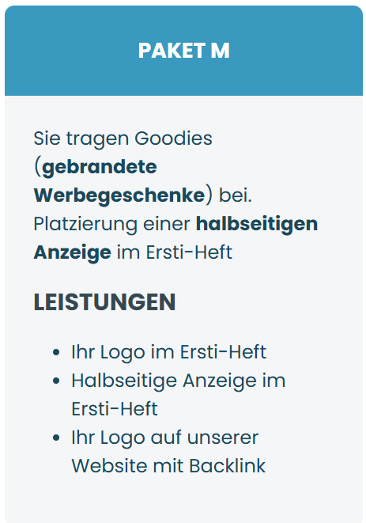

**How to use:**

```html
<PackageBox
  title="Premium Package"
  subtitle="Leistungen im Überblick"
  color="primary_blue_bg"
  services={[
    "Service 1",
    "Service 2", 
    "Service 3"
  ]}
>
  <p>Additional content can be placed here.</p>
</PackageBox>
```

- `title` - main heading displayed in the colored header section
- `subtitle` - secondary heading in the content area
- `color` - background color for the header, either "primary_blue_bg" or "petrol_pale_bg"
- `services` - array of service items displayed as a bulleted list
- `children` - any additional JSX content rendered above the subtitle

The component creates a two-section card with a colored header containing the title and a white content area with subtitle, service list, and any additional children content.

## page-head.tsx

**How to use:**

```html
<PageHead 
    title = "{title}" 
    og = "{og}" 
/>
```

This is not a graphic element. It just injects the head information into every page (such as page title, favicon etc.). It is included in 'app.tsx'.

## protokollbox.tsx 
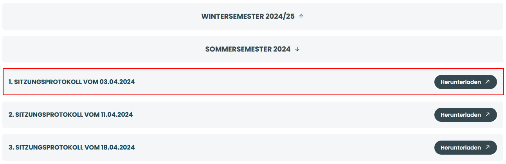

```html
<ProtokollBox
  key = {file}
  buttontext = "Herunterladen"
  buttonlink = {`/assets/downloads/sitzungsprotokolle/${Ordnername}/${file}`}
 >
  {file.replace(/\.pdf$/i, "")}
</ProtokollBox>
```

`ProtokollBox` displays a single protocol entry, showing its title and optionally a download button.
It is used inside an `accordion` to f.e. present a list of meeting protocols.
The PDF is only fetched when the user clicks the button - the browser then requests and opens/downloads the file.

Refer to `sitzungsprotokolle-liste` for the complete component structure.

## responsive-wrapper.tsx

**How to use:**

```html
<ResponsiveWrapper>
  <div>
    <!-- YOUR CONTENT HERE -->
  </div>
</ResponsiveWrapper>
```

This is not a graphic element. It wraps the whole page and adds a margin/padding according to the screen size to keep responsiveness.

## sitzungsprotokolle-list.tsx 

**How to use:**
```html
<Sitzungsprotokolle></Sitzungsprotokolle> 
```

**Structure:**
```html
Sitzungsprotokolle-liste
 ├─ Accordion (per folder)
 │    ├─ ProtokollBox (per file)
 │    │    ├─ Title (file name without .pdf)
 │    │    └─ Button (download link to the PDF)
 │    ├─ ProtokollBox
 │    └─ ...
 ├─ Accordion
 │    └─ ...
```
Fetches meeting protocol folders from `/api/loader_sitzungsprotokolle` and displays them in collapsible `accordion` sections.
Each `accordion` contains multiple `ProtokollBox` entries, each showing a file name (without .pdf) and a download button linking directly to the PDF.

## slider-button.tsx

<br>


**How to use:**

```html
<SliderButton arrow = "right" inverted = {true} onClick = {()  = > showNextSlide()} />
<!-- OR-->
<SliderButton key = {i} number = {i} active = {current  =  =  =  i} onClick = {()  = > onClick(i, mobile)} />
```

- 'arrow' is either left, right or empty.
- 'inverted' defines the color-mode (white with blue text or vice versa)
- 'onClick' sets the callback function that gets triggerd when the button is clicked

- 'number' sets the number of the corresponding page, if the button isn't an arrow
- 'active' is true, when the button links to the current page, else false

- 'disabled' can be set to make a button unclickable (e.g. when the last page is reached)

Used in slideable content to trigger the next/previous page, like the slider on 'Startseite' and the articles/events section in 'Aktuelles'.

## slider.tsx

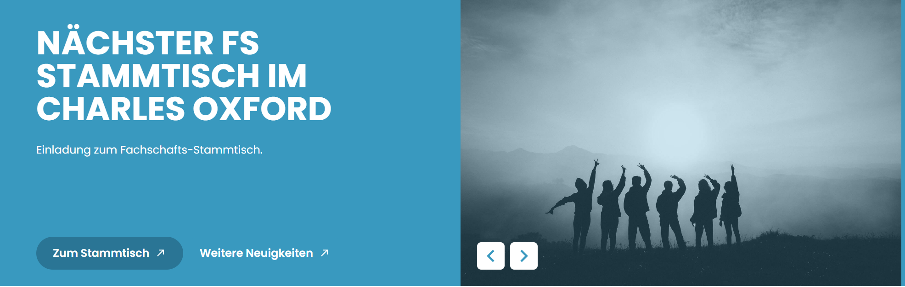

**How to use:**

```html
<Slider slides={slideData} />
```

Where `slideData` is an array of `Slide` objects:

```typescript
const slideData: Slide[] = [
  {
    title: "Willkommen bei der Fachschaft IWI",
    subtitle: "Deine Vertretung in allen Belangen des Studiums",
    buttontext: "Mehr erfahren",
    buttonlink: "/ueber-uns",
    image: "/images/slide1.jpg",
    imageOverlay: "true"
  }
];
```

- `slides` - array of slide objects containing:
  - `title` - main headline of the slide
  - `subtitle` - descriptive text below the title
  - `buttontext` - label for the primary action button
  - `buttonlink` - URL for the primary action button
  - `image` - path to the background image
  - `imageOverlay` - "true" to apply grayscale filter and blue overlay

The slider automatically transitions between slides every 10 seconds and includes navigation arrows. It displays a split layout on desktop with text on the left and images on the right. Used as the main hero section on the homepage.

---

[Back to documentation index](./readme.md)
